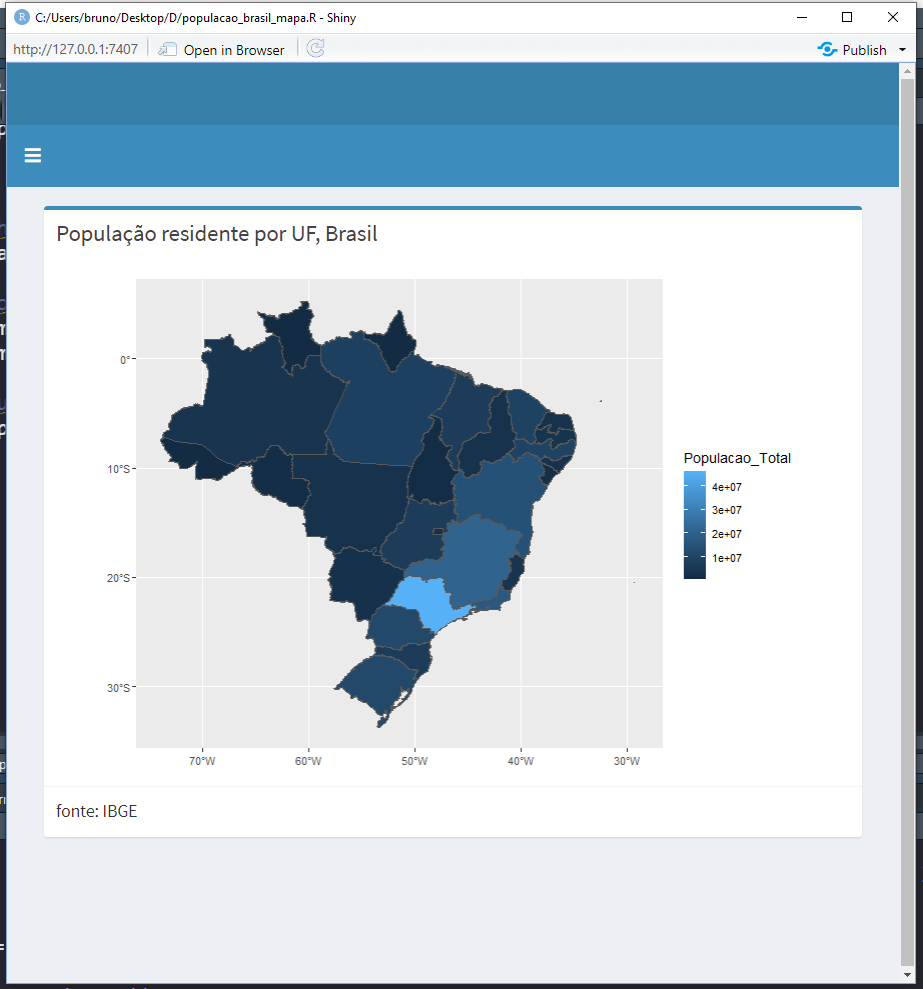
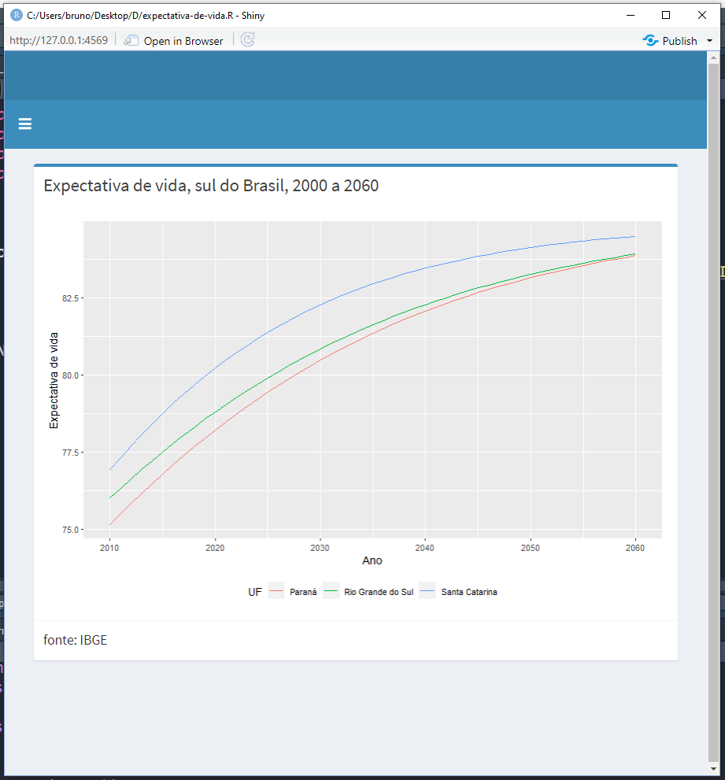
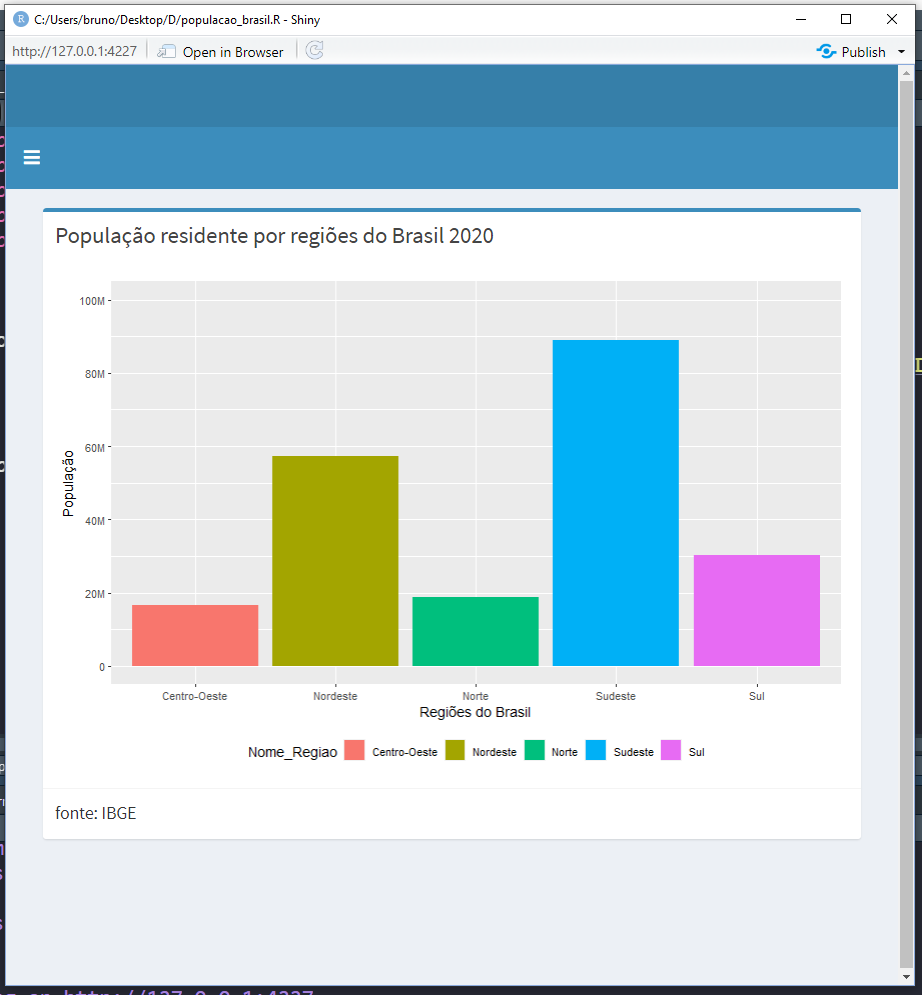
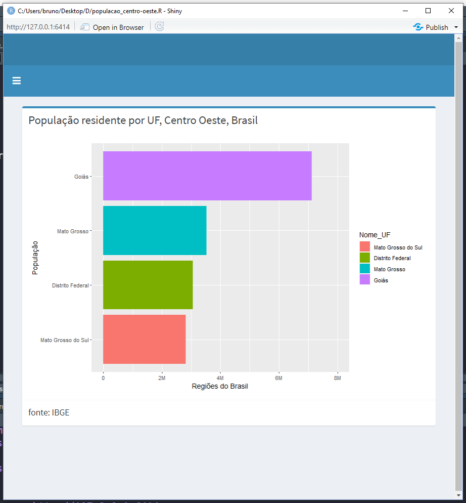

# Vídeo do projeto no youtube 

  

 
https://youtu.be/6vPTXhoK1iA

 
# Gráficos
## População por UF, Brasil

  

## Expectativa de vida no sul do Brasil

  

## População residente por regiões do Brasil em 2020

  

## População residente por UF no centro-oeste do Brasil em 2020

  

